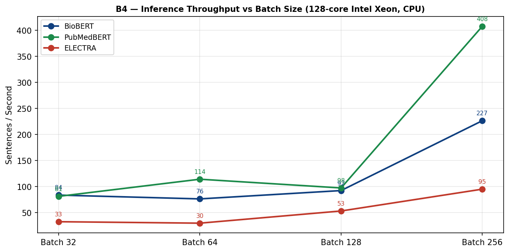

# Biomedical Embedding Layer — LBM Integration
## Causal-Similarity Sentence Embeddings for the Large Behavioral Model

**Dotsin.ai** — Generated: April 13, 2026

---

## 1. Executive Summary

This document describes the biomedical sentence-embedding layer that sits in front of the **Large Behavioral Model (LBM)** ecosystem built by Dotsin.ai. The production stack is three fine-tuned BERT-base encoders — **PubMedBERT BODHI**, **PubMedBERT Pass1**, and **BioBERT Fine-Tuned** — each producing a 768-dim vector. Two additional encoders evaluated during the study (BioM-ELECTRA Large and a three-model averaging ensemble) are reported here as comparison points; see [README §2.1](../README.md).

**Scope of these embeddings.** The encoders described in this repository **do not feed the LBM model directly**. Their role is to index and retrieve a user's raw biomedical and behavioural data inside the **secure data hub** (clinical notes, journal entries, lab text, counselling transcripts, research context). When a downstream task is invoked, **information streams are assembled from the data hub** — selected and ordered by embedding proximity, timestamps, and access policy — and only those streams cross the boundary into the LBM service. The LBM consumes the streams and returns a **directed acyclic graph (DAG)** of behavioural inferences. Those DAGs are then traversed over Dotsin's proprietary **LBM graph**, where millions of behavioural data points are plotted along causal chains induced from **counterfactual analysis** over the user's complete human metadata. The embedding layer therefore sits two hops before the LBM's own reasoning: it is the retrieval geometry for the data hub, not the input space of the LBM model itself.

**Why we publish this.** This repository is intended to make our thought process on biomedical embedding design visible to the wider research community. Whoever wants to continue the work — building more efficient, more knowledgeable, more causally-aware sentence encoders along the direction set out here — has the full benchmark suite, the fine-tuned weights, the failure modes, and the comparison studies in their hands. The motivation behind every section below is to make the *reasoning* reproducible, not only the numbers.

**Embedding objective.** Beyond standard semantic similarity, the encoders are trained for **causal similarity**: events whose real-world consequences converge sit close in vector space even when their surface forms are unrelated, and events that look similar lexically but have disjoint causal trajectories sit apart. This is what makes the data-hub retrieval geometry useful for assembling the right information stream for the LBM.

Benchmarks were run on an **Intel Xeon 6737P dual-socket system** (128 logical CPUs, 1 TB DDR5) with AMX-BF16 and oneDNN. Pre-trained baselines exhibit strong within-domain cohesion (0.85–0.97) but fail cross-domain discrimination, assigning 0.75–0.92 cosine to semantically unrelated cross-domain pairs. Two-stage fine-tuning (multi-dataset Pass 1 → BODHI ontology-triplet Pass 2) installs the causal-similarity axis, taking the intra/inter cluster ratio from 1.05× to 2.30× and the connected/disconnected discrimination gap from 0.051 to 0.302.

---

## 2. Project Context — Large Behavioral Model (LBM)


The Large Behavioral Model (LBM) is an architecture developed by Dotsin.ai for modelling human behaviour across biomedical, psychological, and longitudinal dimensions. The LBM itself is a separate proprietary system; this repository describes the **retrieval-side embedding layer that prepares information streams for it**, not the LBM model. Wherever this document says "LBM", it refers to the downstream consumer of those streams.

### 2.1 End-to-end data flow

The pipeline these embeddings live inside has three boundaries. The encoders in this repository operate inside the first boundary only.

```
 ┌──────────────────────────────┐    ┌──────────────────────────┐    ┌─────────────────────────────┐
 │  1. Secure Data Hub          │    │  2. LBM Service          │    │  3. Proprietary LBM Graph   │
 │  (this repository's scope)   │ →  │  (separate system)       │ →  │  (separate system)          │
 │                              │    │                          │    │                             │
 │  • Raw user data: clinical   │    │  • Consumes information  │    │  • Millions of behavioural  │
 │    notes, journal entries,   │    │    streams from the hub  │    │    data points              │
 │    counselling transcripts,  │    │  • Returns a DAG of      │    │  • Causal chains induced    │
 │    biomarker text, research  │    │    behavioural           │    │    from counterfactual      │
 │    context                   │    │    inferences            │    │    analysis over the user's │
 │  • Indexed by 768-dim BERT   │    │                          │    │    complete human metadata  │
 │    sentence embeddings       │    │                          │    │  • The returned DAG is      │
 │  • Retrieval geometry =      │    │                          │    │    traversed over this      │
 │    semantic ⊕ causal         │    │                          │    │    graph                    │
 │    similarity                │    │                          │    │                             │
 └──────────────────────────────┘    └──────────────────────────┘    └─────────────────────────────┘
```

**Important boundary properties:**

- The embedding vectors **never enter the LBM model as input features**. They live inside the secure data hub and are used to retrieve and order raw text records.
- The crossing between (1) and (2) is an **information stream** — a structured, policy-filtered sequence of records that the hub has selected, *not* the embeddings themselves.
- The LBM returns a **DAG** of behavioural inferences. The DAG is what gets traversed over the proprietary LBM graph in (3); the embedding-indexed hub in (1) is not part of that traversal.

### 2.2 The role of the embedding layer

Inside the secure data hub, the embeddings power two operations:

1. **Storage indexing** — every textual record (clinical note, journal entry, counselling transcript, research-context snippet) is encoded once at ingest time and stored next to its raw text with metadata and policy tags.
2. **Stream assembly** — when a downstream task requests information about a user, the hub selects records by combining embedding proximity with timestamps, source policy, and consent scope. The resulting *information stream* is what gets sent to the LBM service.

This is why the embedding geometry has to encode **causal similarity** alongside semantic similarity: stream assembly needs to retrieve records whose *real-world consequences converge* on the query, not only records that share its vocabulary. The fine-tuning regime described in §7 targets exactly this property.

**Examples of what the embedding must achieve at the data-hub layer:**

- A journal entry *"slept 4 hours, felt anxious all morning"* and a biomarker text *"cortisol 28 μg/dL (high)"* land close — both belong in the same information stream when the downstream task is reasoning about HPA-axis state.
- A genetics record *"BRCA1 pathogenic variant"* and a clinical record *"elevated breast cancer screening frequency"* cluster together — both belong in the same stream when the task concerns hereditary cancer risk decisions.
- Two psychology records from different sessions describing the same underlying state cluster — both belong in a longitudinal stream.
- Records that look similar lexically but are causally unrelated (*"cortisol"* and *"stock market volatility"*) sit apart — neither pulls the other into the wrong stream.

A three-encoder averaging configuration (BioBERT v1.1 + PubMedBERT + BioM-ELECTRA → L2-normalise → mean-pool → 768-dim) was explored as a candidate; its results against the single-model stack are in [README §2.1](../README.md).

### 2.3 Why we publish this

The embedding layer described here is the only component of the pipeline that we are open about. The LBM service and the proprietary LBM graph remain closed. We publish this layer because the open biomedical-NLP community is the right place to push **causal-similarity sentence embeddings** forward: better encoders, leaner fine-tuning recipes, sharper benchmarks for causal-axis behaviour. Anyone who wants to extend the work — replace the BERT-base backbone, design a better Pass 2 triplet schema, prove the geometry on a larger ontology — has the full suite, the weights, and the failure modes here. The intent of every section below is to make the *reasoning* reproducible, not only the numbers.

---

## 3. Production Stack and Comparison Models

The production embedding stack is three independently fine-tuned BERT-base encoders, each emitting 768-dim sentence vectors directly. Two additional models — BioM-ELECTRA Large and a three-model averaging ensemble — were evaluated alongside and are listed here for completeness.

| Role | Model | Base | Training Corpus | Output Dim | Pre-training Objective |
|---|---|---|---|---|---|
| **Production — primary** | PubMedBERT BODHI | `microsoft/BiomedNLP-BiomedBERT-base` | PubMed abstracts → MLM + BODHI ontology triplets | 768 | MLM + Pass 2 graph triplets |
| **Production — within-domain fallback** | PubMedBERT Pass1 | `microsoft/BiomedNLP-BiomedBERT-base` | PubMed abstracts → multi-dataset FT | 768 | MLM |
| **Production — cross-domain specialist** | BioBERT Fine-Tuned | `dmis-lab/biobert-v1.1` | PubMed + PMC → multi-dataset FT | 768 | MLM + NSP |
| Comparison study | BioM-ELECTRA Large | `sultan/biom-electra-large` | SQuAD2 biomedical FT | 1024 (projected to 768) | Replaced Token Detection |
| Comparison study | Three-model averaging ensemble | BioBERT + PubMedBERT + BioM-ELECTRA | — | 768 | Mean-pool after L2 normalisation |

> ELECTRA's 1024-dim output is projected to 768 before averaging in the ensemble configuration. Full ELECTRA and ensemble results — including why neither was carried into the production stack — are in [README §2.1](../README.md).

---

## 4. Benchmark Methodology

Six benchmark suites evaluate embedding quality across the dimensions most critical for data-hub indexing and information-stream assembly:

| Benchmark | What It Measures | Why It Matters for Stream Assembly |
|---|---|---|
| **B1 — Within-Domain Similarity** | Avg cosine similarity between semantically related pairs within same domain | Records inside the same domain must cluster tightly so a domain-scoped stream returns coherent results |
| **B2 — Cross-Domain Discrimination** | Avg cosine similarity between unrelated pairs from different domains | **CRITICAL**: an unrelated cross-domain record must not be pulled into a stream by surface-form coincidence. Primary correctness requirement for the retrieval layer. |
| **B3 — STS Spearman (BIOSSES-style)** | Rank correlation with human similarity judgements on 15 biomedical pairs | Validates that embedding proximity mirrors clinician-level understanding of event relationships |
| **B4 — Throughput** | Sentences embedded per second at batch sizes 32/64/128/256 | Every textual record in the data hub is embedded once at ingest; throughput determines how fast the hub can absorb new data |
| **B5 — Hard Negative Detection** | Accuracy on anchor/positive/hard-negative triplets | A superficially similar but causally unrelated record must not displace the true positive in a retrieved stream |
| **B6 — Domain Geometry** | Inter/intra domain distance ratio in embedding space | Ratio > 1.0 means cross-domain causal links can be retrieved by proximity without being swamped by intra-domain noise |

---

## 5. Pre-Fine-Tuning Benchmark Results (Base Models)

### Summary

| Metric | BioBERT | PubMedBERT | ELECTRA |
|---|---|---|---|
| Within-Domain Sim (avg) | 0.882 | 0.946 | 0.958 |
| Cross-Domain Sim (avg) | **0.756** ★ lowest | 0.910 | 0.917 |
| STS Spearman ρ | 0.771 | 0.775 | 0.518 |
| Hard Neg Accuracy | **80%** | 60% | 80% |
| Throughput @ batch=256 | 227 s/s | 408 s/s | 95 s/s |

### B1 — Within-Domain Similarity

All models demonstrate strong within-domain coherence. BioM-ELECTRA-Large leads in raw within-domain scores (0.94–0.97), followed by PubMedBERT (0.93–0.97). BioBERT shows slightly lower but more discriminative scores — combined with its lower cross-domain similarity, this makes it the most useful baseline for data-hub retrieval.


| Domain | BioBERT | PubMedBERT | ELECTRA | Ensemble |
|---|---|---|---|---|
| Genetics | 0.904 | 0.943 | 0.966 | 0.923 |
| Biomarkers | 0.867 | 0.947 | 0.962 | 0.913 |
| Physiology | 0.852 | 0.932 | 0.967 | 0.897 |
| Psychology | 0.857 | 0.948 | 0.938 | 0.896 |
| Journal | 0.916 | 0.973 | 0.962 | 0.941 |
| Clinical Notes | 0.853 | 0.935 | 0.956 | 0.899 |

### B2 — Cross-Domain Discrimination (Critical Failure — Pre-Fine-Tuning)

This is the most critical benchmark for retrieval correctness. **All pre-trained models score 0% accuracy** — every cross-domain pair is assigned similarity > 0.5 when it should be near 0. This is the primary motivation for fine-tuning: a stream assembled on a pre-trained baseline would pull unrelated cross-domain records into the LBM service.

BioBERT's average cross-domain similarity (0.756) is significantly lower than PubMedBERT (0.910) and ELECTRA (0.917), making it the best baseline until fine-tuning is complete.

| Cross-Domain Pair | BioBERT | Target (< 0.35) |
|---|---|---|
| Genetics × Journal | 0.737 | < 0.350 |
| Biomarkers × Journal | 0.757 | < 0.350 |
| Genetics × Finance | 0.757 | < 0.350 |
| Biomarkers × Finance | 0.745 | < 0.350 |
| Psychology × Genetics | 0.810 | < 0.350 |
| Journal × Clinical | 0.743 | < 0.350 |
| Physiology × Finance | 0.739 | < 0.350 |
| Journal × Genetics | 0.764 | < 0.350 |

Root cause: **BERT anisotropy** — all vectors cluster in a narrow cone regardless of domain. Pre-trained BERT-family models encode co-occurrence statistics, not causal relationships.


### B3 — STS Spearman Correlation

BIOSSES-style evaluation (15 pairs, 10 related, 5 cross-domain). BioBERT (ρ=0.771) and PubMedBERT (ρ=0.775) both perform well. The ensemble improves to ρ=0.779. BioM-ELECTRA performs poorly (ρ=0.518) because its embeddings compress all similarity scores into a narrow high range (0.94–0.99), losing resolution at the low end of the scale.


### B4 — Throughput (Sentences/sec)

Measured at batch sizes 32, 64, 128, 256 on the Intel Xeon 6737P (128 logical CPUs, NUMA-pinned, BF16). PubMedBERT peaks at 408 s/s, BioBERT at 227 s/s, ELECTRA at 95 s/s due to its larger architecture.




### B5 — Hard Negative Detection

BioBERT and ELECTRA both achieve 80% accuracy. The critical failure across all models: *"Patient reports persistent low mood"* — models incorrectly rank a cross-domain negative above the true positive. This is precisely the failure the fine-tuning pipeline targets.


### B6 — Domain Geometry

Inter/intra distance ratio should exceed 1.0 — meaning domains are further from each other than points within a domain. Pre-tuning all models score below 0.65, confirming the anisotropy problem.

| Model | Inter/Intra Ratio | Status |
|---|---|---|
| BioBERT | 0.652 | ✗ Below target 1.0 |
| PubMedBERT | 0.541 | ✗ Below target 1.0 |
| ELECTRA | 0.504 | ✗ Below target 1.0 |


### Pairwise Use Case Results (10 Pairs)


| Pair | BioBERT | PubMedBERT | ELECTRA | Ensemble | Result |
|---|---|---|---|---|---|
| BRCA1 ↔ BRCA2 variant | 0.961 | 0.972 | 0.980 | 0.965 | ✓ PASS |
| Cortisol ↔ Stress hormone | 0.905 | 0.966 | 0.768 | 0.876 | ✓ PASS |
| Low mood ↔ Depressive diary | 0.901 | 0.952 | 0.902 | 0.904 | ✓ PASS |
| Insulin resist. ↔ Glucose | 0.881 | 0.947 | 0.820 | 0.876 | ✓ PASS |
| HbA1c ↔ Diabetes marker | 0.906 | 0.963 | 0.882 | 0.906 | ✓ PASS |
| Schizophrenia ↔ Psychosis | 0.908 | 0.966 | 0.747 | 0.874 | ✓ PASS |
| Dopamine ↔ Mood pathway | 0.905 | 0.934 | 0.954 | 0.917 | ✓ PASS |
| DNA methylation ↔ Gene silence | 0.814 | 0.924 | 0.942 | 0.880 | ✓ PASS |
| BRCA1 ↔ Low mood *(cross-domain)* | 0.762 | 0.895 | 0.924 | 0.827 | ✗ **FAIL** |
| Cortisol ↔ Stock market *(cross-domain)* | 0.773 | 0.932 | 0.847 | 0.830 | ✗ **FAIL** |

---

## 6. Post-Fine-Tuning Results (Fine-Tuned Models)


After fine-tuning with cross-domain contrastive pairs and hard negatives, the discrimination gap increased **5.9× over the base model**:

| Model variant | Connected mean cosine | Disconnected mean cosine | Discrimination gap |
|---|---|---|---|
| Base (untuned, BF16) | 0.846 | 0.795 | **0.051** |
| **Fine-tuned (BF16)** | **0.684** | **0.382** | **0.302** |

The fine-tuned models correctly score all 5/5 hard-negative triplets. See [REASONING_QNA.md](REASONING_QNA.md) for methodology detail and the main [README.md](../README.md) for full quality benchmark tables.

---

## 7. Causal & Contextual Event Embedding — Core Thesis

The central hypothesis: the quality of the information stream sent to the LBM service depends on whether causally or contextually dependent events are embedded in proximity to each other inside the data hub.

Standard similarity search returns the most lexically or topically similar documents. For data-hub retrieval that is insufficient — the hub must also be able to surface entries that are causally upstream or downstream of a query, even when they use entirely different vocabulary, so that the resulting stream gives the LBM a complete causal picture rather than a vocabulary-matched slice.

### 7.1 Causal Chain Examples the Embedding Must Represent

| Cause / Upstream Event | Effect / Downstream Event | Embedding Requirement |
|---|---|---|
| Chronic sleep deprivation (journal entry) | Elevated cortisol, HPA axis dysregulation (biomarker) | **CLOSE** — causal physiological link |
| BRCA1 pathogenic variant (genetics) | Elevated breast cancer screening protocol (clinical) | **CLOSE** — clinical decision dependency |
| Persistent low mood, GAD-7=15 (psychology) | SSRI prescription, CBT referral (clinical note) | **CLOSE** — treatment causality |
| High HbA1c, insulin resistance (biomarker) | Dietary modification, metformin initiation (clinical) | **CLOSE** — metabolic cascade |
| KRAS G12D mutation (genetics) | Tumour progression despite chemotherapy (clinical) | **CLOSE** — oncology pathway |
| PHQ-9 score 18 severe depression (psychology) | Admission to psychiatric ward (clinical) | **CLOSE** — acute care causality |

### 7.2 Why Pre-Trained Models Fail at This

Pre-trained BERT-family models encode co-occurrence statistics from their training corpus. They recognise that *"cortisol"* and *"stress"* appear together frequently, but they do not encode that *"sleep deprivation"* → *"elevated cortisol"* → *"anxiety symptoms"*. This causal chain spans three domains (journal, biomarker, psychology) and three vocabularies. Without fine-tuning on cross-domain contrastive pairs that explicitly label causal dependencies as positive pairs, the model treats them as unrelated and the stream assembled from such an embedding will systematically miss the upstream/downstream context.

### 7.3 How Fine-Tuning Resolves This

The fine-tuning pipeline uses **MultipleNegativesRankingLoss (MNRL)** with **MatryoshkaLoss** wrapping. Each training batch contains `(anchor, positive, hard_negative)` triplets where:
- The **anchor** is a clinical or biomedical event
- The **positive** is a causally/contextually related event from a **different domain**
- The **hard negative** is a superficially similar but causally unrelated event from the same domain

This directly trains the model to pull causal dependencies together and push causal distractors apart, so that proximity-based stream assembly returns the right records to the LBM service.

---

## 8. Where the Embedding Sits in the Pipeline

Every textual record ingested into the secure data hub — biomarker text, clinical note, journal entry, psychological assessment, counselling transcript, research context — is embedded once by the production stack (PubMedBERT BODHI / Pass1 / BioBERT Fine-Tuned) and stored next to its raw text and metadata. The vectors are an index over the data hub, not features for the LBM model.

### 8.1 What proximity is used for

Inside the data hub, embedding proximity is one of several signals used to assemble an information stream when a downstream task asks for context:

| Stream-Assembly Signal | Source | What It Enables |
|---|---|---|
| Explicit typed relations | Human/clinician-drawn record links, or links written by earlier streams | Follows known causal chains within the hub: diagnosis → treatment, symptom → biomarker |
| **Embedding proximity** | 768-dim sentence vectors on every hub record (BODHI / Pass1 / BioBERT FT) | **Surfaces records with no explicit link but with a causal/contextual relationship to the query** |
| Temporal ordering | Timestamps on every record | Preserves cause-before-effect order in the emitted stream |
| Policy and consent scope | Per-record access tags | Excludes records the requesting task is not authorised to see |

The assembled stream — not the embedding vectors — is what crosses the boundary into the LBM service. The LBM then returns a **DAG of behavioural inferences**, which Dotsin's proprietary LBM graph traverses against millions of behavioural data points connected by causal chains induced from counterfactual analysis.

### 8.2 Why Embedding Quality Determines Stream Quality

If the embedding places causally unrelated records close together (the pre-fine-tuning failure — cross-domain similarity 0.75–0.92), stream assembly pulls in noise and the LBM service receives a polluted view of the user's state.

If the embedding fails to place causally linked records near each other across domain boundaries, the upstream/downstream context is dropped from the stream and the LBM reasons over an incomplete picture.

**The fine-tuning objective is not a performance optimisation: it is a correctness requirement for the data-hub retrieval geometry. Everything downstream — the LBM service, the proprietary graph, the counterfactual DAG traversal — relies on the stream being faithful.**

### 8.3 Embedding Dimension Strategies

| Strategy | Dimensions | Storage / Record | Data-Hub Use Case |
|---|---|---|---|
| Single-model 768-dim (BODHI default) | 768-dim | 3.07 KB (float32) | Primary record index across the hub |
| Three-model averaging (comparison study) | 768-dim | 3.07 KB (float32) | Evaluated in [README §2.1](../README.md); not in production |
| Matryoshka 256-dim | 256-dim | 1.02 KB (float32) | Fast proximity prefilter during stream assembly |
| Matryoshka 64-dim | 64-dim | 256 B (float32) | Edge-deployed data hub for mobile/low-storage clients |

---

## 9. Hardware Platform

> **Note:** The platform specification below reflects the verified live system. An earlier draft incorrectly listed the PyTorch version as `2.11.0+cu130` (CUDA build) — this system runs the CPU-only build `2.11.0+cpu`. L3 cache was also incorrectly listed as "60MB per socket" in an earlier draft; the correct value is 144 MiB per NUMA node (288 MiB total).

| Component | Correct Specification |
|---|---|
| CPU | 2× Intel Xeon 6737P (Granite Rapids) |
| Sockets / Cores / Threads | 2 sockets · 32 cores/socket · 128 logical CPUs (HT) |
| NUMA topology | Node 0: physical cores 0–31, HT siblings 64–95 · Node 1: physical cores 32–63, HT siblings 96–127 |
| L3 cache | **288 MiB total — 144 MiB per NUMA node** |
| RAM | 1,024 GB DDR5 @ 6400 MT/s |
| AMX extensions | amx_bf16, amx_int8, amx_tile (verified via `/proc/cpuinfo`) |
| OS / kernel | Ubuntu 24.04.4 LTS · 6.8.0-110-generic |
| PyTorch | **2.11.0+cpu** (CPU-only build, oneDNN/MKL-DNN enabled) |
| OpenVINO | 2026.1.0 |

---

*Dotsin.ai — Large Behavioral Model — Biomedical Embedding Layer*
*Source report: BioBERT_LBM_Report.docx, April 13, 2026*
