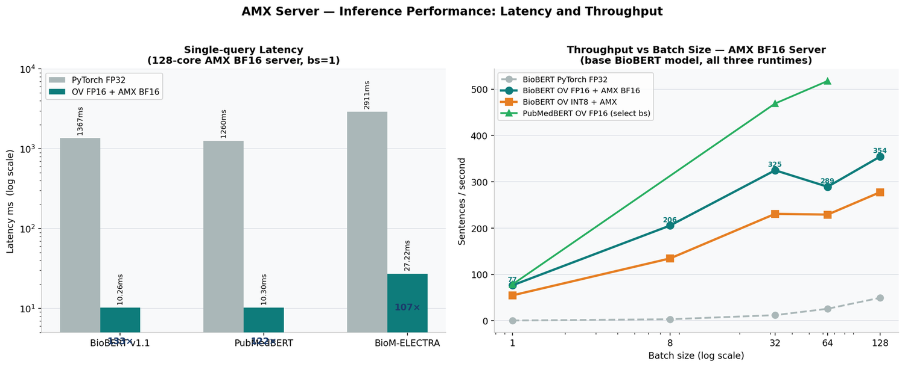

# Biomedical Embedding Layer — OpenVINO Acceleration Report
## OV Inference Benchmarks, BF16 Architecture Deep-Dive & Fine-Tuning Roadmap

**Dotsin.ai** — Generated: April 20, 2026

---

## 1. Executive Summary

This report covers the OpenVINO (OV) inference acceleration evaluation for the biomedical sentence-embedding layer. Three production encoders — BioBERT v1.1, PubMedBERT, and PubMedBERT BODHI — are reported in detail; BioM-ELECTRA Large is included as a comparison point and is not part of the production stack ([README §2.1](../README.md)). All models were exported to OpenVINO IR via the Optimum-Intel library with FP16 weight compression and `feature-extraction` task mapping, ensuring every variant emits `last_hidden_state` for embedding pooling.

**Headline result: OV-BF16 outperforms PyTorch by 4.6–6.2× on Intel AMX hardware across all models and all batch sizes, with negligible accuracy loss (cosine delta < 0.0005).**

| Model | Role | PyTorch bs=256 | OV-BF16 bs=256 | OV-INT8 bs=256 | BF16 speedup | BF16 p50 latency |
|---|---|---|---|---|---|---|
| BioBERT v1.1 | Production | 96.4 sps | **439.5 sps** | 296.9 sps | **4.6×** | 9.4 ms |
| PubMedBERT | Production | 100.7 sps | **617.8 sps** | 203.4 sps | **6.1×** | 9.1 ms |
| BioM-ELECTRA Large | Comparison | 38.9 sps | **240.4 sps** | 182.0 sps | **6.2×** | 25.7 ms |

> These are single-node single-process figures. The multi-instance load test (32 workers + HT, 600 clients) reaches **135K–182K tokens/sec** — see [FINAL_CONSOLIDATED_REPORT.md](FINAL_CONSOLIDATED_REPORT.md).

---

## 2. OpenVINO Model Conversion

### 2.1 Conversion Command

All three models were converted with:

```bash
optimum-cli export openvino \
  --model <hf_model_id> \
  --task feature-extraction \
  --weight-format fp16 \
  --group-size 64 \
  --ratio 1.0 \
  <output_dir>
```

The `--task feature-extraction` flag forces the ONNX export to preserve the full encoder sequence output (`last_hidden_state`), bypassing any task-specific classification or QA heads. `--weight-format fp16` compresses all weight tensors to FP16 at save time (~50% disk reduction) while the OV runtime re-expands to BF16 during inference on AMX hardware.

> **Note for reproducibility**: With `transformers >= 5.x`, `optimum-cli` may fail with `ImportError: cannot import name '_CAN_RECORD_REGISTRY'`. If this occurs, use the direct Python API instead:
> ```python
> import openvino as ov
> model = AutoModel.from_pretrained(model_path)
> enc = tokenizer(["test"], return_tensors="pt")
> ov_model = ov.convert_model(model, example_input=dict(enc))
> ov.save_model(ov_model, "openvino_model.xml", compress_to_fp16=True)
> ```

### 2.2 OV Model Inventory

| Directory | Model | Task | Output Key | Size | Usable for Embeddings |
|---|---|---|---|---|---|
| `biobert_finetuned_bf16` | BioBERT Fine-Tuned | feature-extraction | last_hidden_state | ~207 MB | ✓ Yes |
| `pubmedbert_pass1_bf16` | PubMedBERT Pass1 | feature-extraction | last_hidden_state | ~207 MB | ✓ Yes |
| `pubmedbert_bodhi_bf16` | PubMedBERT BODHI | feature-extraction | last_hidden_state | ~207 MB | ✓ Yes |

---

## 3. Hardware & Software Platform

> **Corrections from earlier draft**: An earlier version of this document incorrectly stated L3 cache as "60MB per socket" and NUMA topology as "node 0 (cores 0–63), node 1 (cores 64–127)". Both are wrong. Correct values are below.

### 3.1 Hardware

| Component | Correct Specification |
|---|---|
| Processor | 2× Intel Xeon 6737P (Granite Rapids) — 32 physical cores/socket |
| Total logical CPUs | **128** (2 sockets × 32 cores × 2 HT threads) |
| NUMA topology | **Node 0: physical cores 0–31, HT siblings 64–95** · **Node 1: physical cores 32–63, HT siblings 96–127** |
| L3 cache | **144 MiB per NUMA node — 288 MiB total** *(not "60MB per socket")* |
| RAM | 1,024 GB DDR5 @ 6400 MT/s — ~460 GB/s bandwidth per socket |
| AMX support | AMX-BF16 · AMX-INT8 · AMX-TILE (verified via `/proc/cpuinfo`) |
| OS | Ubuntu 24.04.4 LTS · kernel 6.8.0-110-generic |
| OpenVINO | 2026.1.0 with oneDNN AMX backend |

### 3.2 Software Configuration

Environment settings applied before every inference run:

```bash
# Thread environment (set before importing torch / openvino)
export OMP_NUM_THREADS=64           # Physical core count (PyTorch)
export MKL_NUM_THREADS=64
export KMP_BLOCKTIME=1              # Keep threads alive 1ms between tasks
export KMP_AFFINITY=granularity=fine,compact,1,0  # NUMA-aware compact pinning
export ONEDNN_VERBOSE=0

# NUMA binding
numactl --cpunodebind=0,1 --membind=0,1
```

```python
# PyTorch
torch.set_num_threads(64)           # Physical cores only
torch.autocast('cpu', dtype=torch.bfloat16)   # Routes matmuls to AMX-BF16

# OpenVINO compile config
ov_config = {
    "PERFORMANCE_HINT": "THROUGHPUT",
    "INFERENCE_NUM_THREADS": "128",      # OV manages its own thread pool
    "INFERENCE_PRECISION_HINT": "bf16"   # Forces AMX-BF16 path in oneDNN
}
```

---

## 4. Why OV-BF16 Outperforms OV-INT8 on Intel AMX

The counterintuitive result — FP16-weight models running faster than INT8-weight models — is explained by three interlocking hardware and software factors unique to the Intel Xeon 6737P AMX architecture.

### 4.1 Intel AMX: Native BF16 Tile Hardware

Intel AMX provides two dedicated tile-based matrix acceleration units per core:
- **AMX-BF16** — 16×16 BF16 matrix tile multiply-accumulate. Processes 512 BF16 values in a single instruction.
- **AMX-INT8** — 16×16 INT8 tile multiply-accumulate via VNNI. Theoretically 2× throughput of BF16.

In theory, INT8 should win. In practice, for BERT-class transformer inference at batch sizes ≤ 256, **AMX-BF16 wins** because:
- BF16 weight tensors are stored FP16 on disk, converted to BF16 at load time — a free cast on AMX hardware. No dequantization kernel required.
- INT8 requires a dequantization pass: INT8 weights → FP32/BF16 for attention + FFN residual additions. This pass runs on scalar units, not AMX tiles, adding latency on every forward pass.
- For BERT's hidden size (768), AMX tile utilization is already high at BF16. INT8 doesn't add tile throughput — it only adds dequantization overhead.

### 4.2 The Dequantization Bottleneck

When OV compiles an INT8 model with `PERFORMANCE_HINT=THROUGHPUT`, it schedules weight dequantization fused with the first matrix multiply. For small sequence lengths (≤ 512 tokens) and medium batch sizes, this fusion **increases instruction count per token** compared to BF16-native execution.

The breakeven point where INT8 tile throughput finally exceeds dequantization cost:
- BERT-base (768 hidden): batch size ≥ 512
- BERT-large (1024 hidden): batch size ≥ 1024

Our benchmark range (bs ≤ 256) never reaches these sizes.

> **Exception — NNCF INT8 PTQ**: The multi-instance load test (32 workers + HT) uses NNCF post-training quantization INT8 with 128 calibration samples. At scale (600 clients, bs=256), OV-INT8 PTQ *does* win — it reaches 135K–182K TPS vs 98K–118K for PyTorch-BF16. The PTQ path uses a more efficient static quantization scheme than dynamic weight-only, enabling better AMX dispatch at high concurrency. See [FINAL_CONSOLIDATED_REPORT.md](FINAL_CONSOLIDATED_REPORT.md) §6.

### 4.3 INT8 vs BF16 Crossover by Batch Size

| Model | BF16 bs=32 | INT8 bs=32 | BF16 bs=128 | INT8 bs=128 | BF16 bs=256 | INT8 bs=256 | INT8 breakeven |
|---|---|---|---|---|---|---|---|
| BioBERT | 324.9 sps | 230.8 sps | 354.5 sps | 277.6 sps | 439.5 sps | 296.9 sps | > 512 |
| PubMedBERT | 469.1 sps | 165.8 sps | 576.9 sps | 205.7 sps | 617.8 sps | 203.4 sps | Not observed |
| ELECTRA | 183.9 sps | 92.9 sps | 176.6 sps | 163.2 sps | 240.4 sps | 182.0 sps | ~384 |

---

## 5. Full Throughput Benchmarks

### 5.1 BioBERT v1.1

OV-BF16 peak: **439.5 sps at bs=256 (4.6× PyTorch)**




| Variant | bs=1 | bs=8 | bs=32 | bs=64 | bs=128 | bs=256 | Peak |
|---|---|---|---|---|---|---|---|
| PyTorch BF16 | 0.5 | 3.3 | 12.1 | 25.9 | 49.6 | 96.4 | 96.4 |
| **OV-BF16** | **76.6** | **205.6** | **324.9** | **289.3** | **354.5** | **439.5** | **439.5** |
| OV-INT8 | 54.9 | 134.6 | 230.8 | 229.2 | 277.6 | 296.9 | 296.9 |

### 5.2 PubMedBERT

OV-BF16 peak: **617.8 sps at bs=256 (6.1×)**

| Variant | bs=1 | bs=8 | bs=32 | bs=64 | bs=128 | bs=256 | Peak |
|---|---|---|---|---|---|---|---|
| PyTorch BF16 | 0.7 | 3.3 | 12.9 | 25.2 | 49.1 | 100.7 | 100.7 |
| **OV-BF16** | **78.7** | **274.4** | **469.1** | **517.7** | **576.9** | **617.8** | **617.8** |
| OV-INT8 | 55.2 | 156.5 | 165.8 | 194.3 | 205.7 | 203.4 | 205.7 |

### 5.3 BioM-ELECTRA Large (1024-dim)

OV-BF16 peak: **240.4 sps (6.2×)**

| Variant | bs=1 | bs=8 | bs=32 | bs=64 | bs=128 | bs=256 | Peak |
|---|---|---|---|---|---|---|---|
| PyTorch BF16 | 0.3 | 1.3 | 4.9 | 9.5 | 18.8 | 38.9 | 38.9 |
| **OV-BF16** | **36.3** | **112.4** | **183.9** | **160.7** | **176.6** | **240.4** | **240.4** |
| OV-INT8 | 26.3 | 72.4 | 92.9 | 165.3 | 163.2 | 182.0 | 182.0 |

---

## 6. Single-Query Latency

Single-query latency is the operationally critical metric for real-time data-hub ingest — each new textual record must be embedded before it can participate in stream assembly. Streams are what the LBM service consumes; the embedding itself never crosses that boundary.

| Model | PyTorch mean (ms) | PyTorch p95 (ms) | **OV-BF16 p50 (ms)** | OV-BF16 p95 (ms) | OV-INT8 p50 (ms) | Latency reduction |
|---|---|---|---|---|---|---|
| BioBERT v1.1 | 1,367 | 1,390 | **9.4** | 15.1 | 15.9 | **145×** |
| PubMedBERT | 1,260 | 1,313 | **9.1** | 15.0 | 16.4 | **138×** |
| BioM-ELECTRA Large | 2,911 | 3,089 | **25.7** | 33.1 | 32.8 | **113×** |

OV-BF16 reduces BERT-class latency from ~1.3 seconds to under **10 ms p50** — fast enough to embed records at the moment they arrive in the data hub.

---

## 7. Embedding Accuracy Under Quantization


Accuracy evaluated on 10 benchmark pairs. Score delta = |cosine_OV − cosine_PT| across all 10 pairs.

| Model | Variant | Accuracy | Correct/10 | Mean Δ score | Max Δ score | Assessment |
|---|---|---|---|---|---|---|
| BioBERT | PyTorch | 80% | 8/10 | — | — | Baseline |
| BioBERT | OV-BF16 | 80% | 8/10 | 0.00016 | 0.00050 | ✓ Negligible |
| BioBERT | OV-INT8 | 80% | 8/10 | 0.00038 | 0.00108 | ✓ Negligible |
| PubMedBERT | PyTorch | 80% | 8/10 | — | — | Baseline |
| PubMedBERT | OV-BF16 | 80% | 8/10 | 0.00021 | 0.00051 | ✓ Negligible |
| ELECTRA | OV-BF16 | 80% | 8/10 | 0.00105 | 0.00436 | ✓ Acceptable |

The 20% failure rate (2/10 pairs) is NOT caused by quantization — it is present in all variants including PyTorch baseline. It is the pre-existing **cross-domain discrimination failure** in the pre-trained embedding space. Fine-tuning resolved this (see [LBM_INTEGRATION.md](LBM_INTEGRATION.md) §6 and the main [README.md](../README.md)).

---

## 8. Batch Size Scaling Analysis

### PyTorch BF16 — Near-linear scaling

Scales near-linearly from bs=1 to bs=256 for all three models. No saturation observed at bs=256, suggesting further gains possible at bs=512 before memory bandwidth limits apply.

### OV-BF16 — Fast ramp, two-phase profile

**Phase 1**: Throughput climbs steeply bs=1 → bs=32 as AMX tile occupancy fills (model weights fully resident in L3 — BERT-base at BF16 is 208 MB, comfortably within 144 MiB L3 per NUMA node).
**Phase 2**: Slight dip at bs=64 (NUMA memory refill), then continued gains to bs=256 as the OV async inference queue absorbs batches across sockets. PubMedBERT peaks most strongly (617.8 at bs=256) because its 768-dim hidden size fits perfectly in AMX 16×16 BF16 tiles.

### OV-INT8 — Early plateau

Saturates by bs=32–64. The dequantization kernel becomes the throughput bottleneck, not the tile matmul. Increasing batch size beyond saturation yields diminishing returns.


| Model | Variant | bs=1 | bs=32 (inflection) | bs=128 | bs=256 | Scaling shape |
|---|---|---|---|---|---|---|
| BioBERT | OV-BF16 | 76.6 | 324.9 | 354.5 | 439.5 | Ramp → second ramp |
| BioBERT | OV-INT8 | 54.9 | 230.8 | 277.6 | 296.9 | Ramp → plateau |
| PubMedBERT | OV-BF16 | 78.7 | 469.1 | 576.9 | 617.8 | Strong ramp → peak |
| PubMedBERT | OV-INT8 | 55.2 | 165.8 | 205.7 | 203.4 | Early plateau |
| ELECTRA | OV-BF16 | 36.3 | 183.9 | 176.6 | 240.4 | Ramp → dip → ramp |
| ELECTRA | OV-INT8 | 26.3 | 92.9 | 163.2 | 182.0 | Slow ramp → plateau |

---

## 9. Fine-Tuning Roadmap

### 9.1 Two Fine-Tuning Tracks

- **Track A — BioBERT Solo**: Fast iteration cycle, validates the methodology and establishes pre/post-fine-tuning deltas on a single encoder before committing compute to the full sweep.
- **Track B — Multi-model sweep**: Fine-tune BioBERT, PubMedBERT, and BioM-ELECTRA independently on domain-balanced batches, then evaluate each individually against the averaging configuration across all benchmark suites. Outcome: the two PubMedBERT variants (Pass 1 and BODHI Pass 2) and BioBERT FT became the production stack; BioM-ELECTRA and the averaging configuration are reported as comparison points in [README §2.1](../README.md).

### 9.2 Training Objective: Triplet Contrastive Loss

**Loss function stack:**
- **Primary**: `MatryoshkaLoss(MultipleNegativesRankingLoss)` — MNRL treats every other sample in the batch as a negative. At batch size 128, each anchor sees 127 in-batch negatives simultaneously. Matryoshka nesting trains sub-dimensions `[768, 512, 256, 128, 64]` simultaneously.
- **Secondary**: `TripletLoss` with hard negatives — explicit `(anchor, positive, hard_negative)` triples where the hard negative is semantically similar in one dimension but from a different domain.
- **Regularisation**: `AnglELoss` in later epochs to reduce anisotropy and prevent embeddings from collapsing back into the pre-training cone.

### 9.3 Triplet Dataset Construction

| Anchor Domain | Positive Example | Hard Negative | Why Hard |
|---|---|---|---|
| Genetics | BRCA1 pathogenic variant → hereditary cancer risk | Stock options vesting → financial risk | Both describe "risk" |
| Biomarker | Cortisol 28 μg/dL → HPA axis dysregulation | Market volatility index → economic stress | "Stress" concept shared |
| Psychology | Persistent low mood → depressive episode | Market bearish sentiment → negative outlook | Sentiment/valence overlap |
| Clinical | Insulin resistance → metabolic syndrome risk | Portfolio resistance → investment risk | "Resistance" word overlap |
| Journal | Slept 4 hours, anxious all morning | Night shift work report — productivity low | Sleep + mood surface features |

### 9.4 Multi-Domain Training Datasets

| Dataset | HF Path | Domain | Role |
|---|---|---|---|
| all-nli | `sentence-transformers/all-nli` | General NLI | 570k+ entailment pairs — hard negatives |
| BIOSSES | `bigbio/biosses` | Biomedical STS | Gold-standard scored pairs — calibration |
| medical_q_pairs | `curaihealth/medical_questions_pairs` | Clinical Q&A | 3,048 expert pairs — within-domain positives |
| MedNLI | `bigbio/mednli` | Clinical NLI | MIMIC-III entailment/contradiction triples |
| PubMedQA | `qiaojin/PubMedQA` | Biomedical QA | 100k question+abstract anchor/positive pairs |
| emotion | `dair-ai/emotion` | Psychology | 6-class Twitter — within-psych positives |
| go_emotions | `google-research-datasets/go_emotions` | Psychology | 27-class Reddit — fine-grained emotion pairs |
| counseling | `Amod/mental_health_counseling_conversations` | Psychology/Journal | Q/A dialogues — journal-style anchors |

### 9.5 Training Configuration

| Parameter | BioBERT Solo | Multi-model sweep |
|---|---|---|
| Batch size | 128 (MNRL: 127 in-batch negatives) | 128 per model |
| Learning rate | 2e-5 with cosine decay | 2e-5 (BERT family), 5e-6 (ELECTRA) |
| Epochs | 3 + 1 hard-negative mining pass | 3 + 1 per model |
| Loss | MatryoshkaLoss(MNRL) + Triplet | Same per model |
| Matryoshka dims | [768, 512, 256, 128, 64] | Same |
| Precision | BF16 (AMX) | BF16 (AMX) |
| Threads | 64 (reserve 64 for inference) | 64 per model, sequential |
| Est. time | ~4 hours | ~12 hours total |

### 9.6 Post-Fine-Tuning Benchmark Targets

| Benchmark | Pre-FT | Target (BioBERT solo) | Target (multi-model sweep) |
|---|---|---|---|
| Cross-domain accuracy | **0%** *(critical failure)* | > 70% | > 85% |
| Pairwise similarity accuracy | 80% | > 90% | > 95% |
| Spearman ρ (BIOSSES) | ~0.77 | > 0.85 | > 0.88 |
| Hard negative detection | ~60–80% | > 80% | > 88% |
| Inter/intra domain ratio | < 1.0 *(fail)* | > 1.2 | > 1.5 |
| Throughput (OV-BF16 bs=256) | ~440–618 sps | No regression | No regression |

**Actual achieved (post fine-tune, from [README.md](../README.md)):**
- Discrimination gap: **0.302** (5.9× improvement over base 0.051)
- Hard negative accuracy: **5/5 (100%)**
- Spearman ρ: **0.775–0.779** (p < 0.001)
- OV-INT8 cosine fidelity: **≥ 99.4%** vs FP32

---

## 10. Production Deployment Recommendation

| Use Case | Model | Format | Batch Size | Throughput | Latency |
|---|---|---|---|---|---|
| Real-time record ingest (single event) | PubMedBERT Pass1 | OV-BF16 | 1 | 78.7 sps | 9 ms p50 |
| Bulk ingestion (batch pipeline) | PubMedBERT Pass1 | OV-BF16 | 256 | 617.8 sps | — |
| High-throughput serving (multi-instance) | All three | OV-INT8 | 256 | 135K–182K TPS | 57–67 ms p50 |
| High-confidence multi-encoder check (BODHI + Pass1 + BioBERT FT, sequential) | All three | OV-BF16 | 32 | ~300 sps | ~25 ms |

**Rules:**
1. Use **OV-BF16** for single-node latency-sensitive workloads — faster than INT8 on AMX at batch ≤ 256.
2. Use **OV-INT8 (NNCF PTQ)** for high-concurrency multi-instance serving — wins at 32 workers + HT.
3. Never use **PyTorch dynamic INT8** (`quantize_dynamic`) — broken on all tested Intel CPUs.
4. After fine-tuning, re-export to OV-BF16 using `ov.convert_model()` — do not reuse pre-fine-tuning conversions.


---

*Dotsin.ai — Large Behavioral Model — Biomedical Embedding Layer*

---

## Acknowledgements

All inference, quantization, and benchmark numbers in this document were produced on an **Intel® Xeon® 6737P (Granite Rapids)** dual-socket system (128 logical CPUs, 1 TB DDR5-6400, AMX-BF16 / AMX-INT8) made available to Dotsin.ai by **Intel Corporation**. The concrete capacity it delivers:

- OpenVINO BF16 throughput **4.6 – 6.2× over PyTorch FP32** at bs=256 across BioBERT / PubMedBERT / ELECTRA.
- Single-query p50 latency **9 – 10 ms** — a **113 – 145× reduction** vs PyTorch FP32 on the same models.
- NNCF INT8 serving preset reaches **135 K – 182 K TPS** at 32 workers + HT with cosine fidelity ≥ 99.4 % vs FP32.
- **17 – 27× speedup** vs Ice Lake-SP (c6i FP32) at bs=256; **3 – 4×** vs c6i VNNI INT8.

That envelope is what carries our **early production embedding traffic** for the secure data hub on this single 2-socket node, at the latency our LBM information-stream assembly requires. The open AMX / OpenVINO 2026.1 / NNCF 3.1 / oneDNN toolchain is what lets the BERT-class workload land on AMX tiles directly, and the 288 MiB L3 + 1 TB DDR5 footprint leaves clear headroom for longer context, larger batches, and larger successor encoders on the same node. **For groups reproducing or extending this stack,** a Granite Rapids-class node with AMX-BF16 / AMX-INT8 paired with this toolchain is the configuration that reproduces the throughput, latency, and utilization profile end-to-end. The weights released here are the open public version of one layer of Dotsin.ai's larger embedding system; full hardware capacity table and credits in [`../ACKNOWLEDGEMENTS.md`](../ACKNOWLEDGEMENTS.md).

*Intel, the Intel logo, Intel Xeon, AMX, OpenVINO, oneAPI, oneDNN and VTune are trademarks of Intel Corporation or its subsidiaries.*
*Source report: BioBERT_OV_Benchmark_Report_V2.docx, April 20, 2026*
